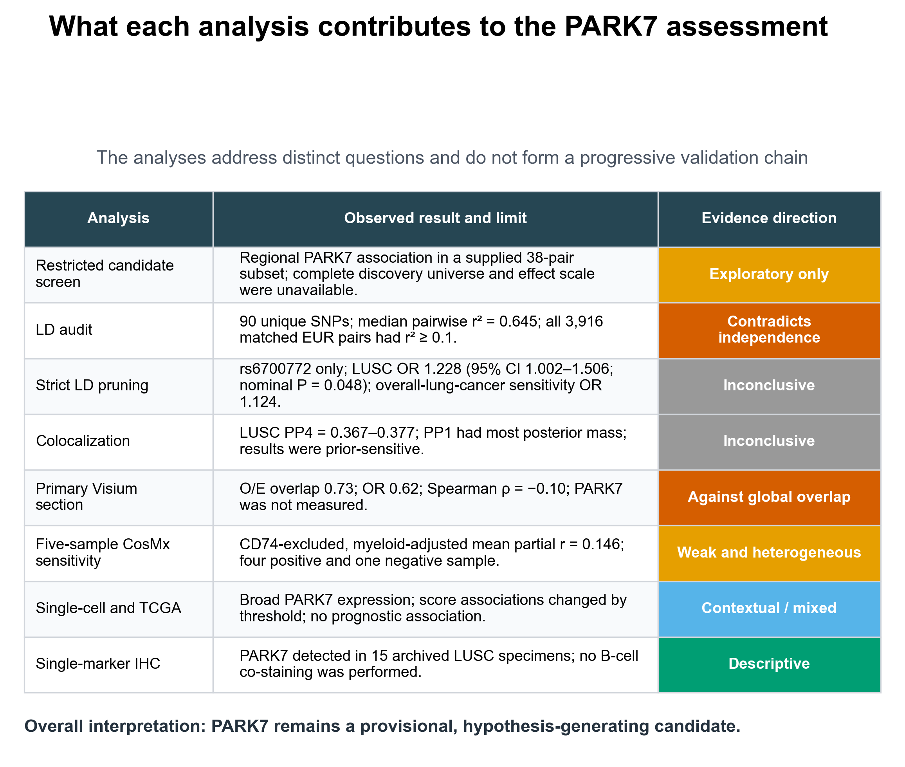

# scMR-PARK7-LUSC

Code, processed inputs, revision results, and figures for:

**Cross-modal assessment of PARK7 in lung squamous cell carcinoma reveals limited convergence across genetic, spatial, and tissue evidence**

This repository represents the 2026-07-24 major-revision analysis state. It replaces the earlier candidate-prioritization layout.

## Main conclusion

The available evidence does not establish an LD-independent causal effect, a shared causal variant, a PARK7-positive B-cell niche, a PARK7-specific stress program, prognostic value, or B-cell-specific protein localization.

Key revision findings:

- The submitted leave-one-out table contained 91 rows but 90 unique variants.
- Of 90 unique variants, 89 matched the 1000 Genomes European reference.
- Median pairwise r-squared was 0.645; all 3,916 matched pairs had r-squared at least 0.1.
- PLINK clumping at r-squared below 0.001 retained rs6700772 only.
- With the LUSC-specific outcome (GCST004750), the rs6700772 Wald ratio was
  OR 1.228 (95% CI 1.002-1.506; nominal P=0.048).
- The histology-unspecific overall-lung-cancer sensitivity outcome (GCST004748)
  gave OR 1.124 (95% CI 0.991-1.274; P=0.069).
- In LUSC, PP1 exceeded PP4 under the primary colocalization prior; PP4 was
  0.367-0.377.
- The primary Visium section did not measure PARK7 and showed below-expected
  marker overlap across six threshold definitions; within-block permutation
  support varied with threshold and block scale.
- Adjusted CosMx associations were weak and heterogeneous.
- Single-cell score associations depended on threshold.
- PARK7 RNA and DJ-1 RPPA values were moderately correlated in 320 matched
  TCGA-LUSC tumors, but neither analyte was associated with overall survival
  after clinical and KEAP1/NFE2L2/CUL3 mutation adjustment.
- IHC remained descriptive and did not identify the stained cell type.



## Repository layout

```text
data/
  inputs/                 Processed inputs retained for revision analyses
  revision_results/       Reported major-revision result tables
figures/
  main/                   Four revised main figures in PNG and TIFF
  supplementary/          Descriptive PARK7 IHC supplementary figure
scripts/
  revision/               Portable revision analysis and figure scripts
  check_repository_integrity.py
docs/
  DATA_AVAILABILITY.md
  REPRODUCIBILITY_NOTES.md
  MAJOR_REVISION_AUDIT.md
```

## Quick start

Create the environment:

```bash
conda env create -f environment.yml
conda activate scmr-park7-lusc
```

Check repository integrity:

```bash
python scripts/check_repository_integrity.py
```

Reproduce the included-input Visium threshold/permutation, single-cell
threshold, and colocalization tables:

```bash
python scripts/revision/run_major_revision_analyses.py
```

Rebuild the four main figures from included processed inputs and revision results:

```bash
python scripts/revision/build_revision_figures.py
```

The LD, CosMx, and TCGA steps require external resources that are not
redistributed. The repository includes the retained 38-pair MR source table,
spatial feature-coverage audit, and patient-level GDC pathway-mutation status
used by the TCGA sensitivity models. See
[Reproducibility Notes](docs/REPRODUCIBILITY_NOTES.md).

## Data and privacy boundaries

This repository contains processed public-data inputs, derived summary tables, and de-identified IHC summaries. It does not contain raw identifiable pathology records, submission Word files, reviewer correspondence, or local quality-control artifacts.

The earlier CMap outputs and figures based on the uncorrected independent-instrument interpretation were removed from the current branch. Git history preserves prior versions for provenance; they should not be used as the current analysis state.

## Citation

Please cite the associated manuscript when available and reference:

`https://github.com/morningLxj/scMR-PARK7-LUSC`
